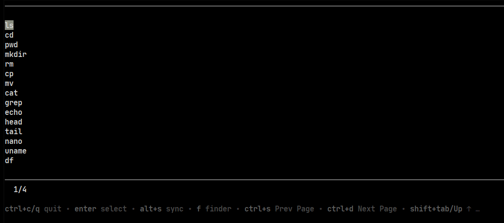

# 🚀 - Vault cmd-line terminal app
- That project can store your bash/zsh history in SQLite offers a convenient and effective method for organizing and retrieving command-line typed.
- The convenience of TUI empowers you to browse and search your 'history' using simple key strokes, enhancing the convenience of accessing and scrutinizing your previous commands.

## Installation
- Download the binary through [Latest version](https://github.com/grrlopes/storydb/releases) and place storydb into ```/bin``` or Clone the project and run ```go run build```
- You can overwrite your currently crt+r by ```bind '"\C-r": "\C-a storydb \C-j"'``` put it in your global variable as ```/etc/profile``` or ```$HOME/profile```



You can conveniently explore and interact with your command-line history, making it easier to recall past commands, analyze usage patterns, and improve your workflow in the terminal.

## ⌨️  Button Mapping
| Key             | Event                     |
|-----------------|---------------------------|
| k, shift+tab, ↑ | up                        |
| ctrl+d, →       | page right                |
| j, ↓            | down                      |
| ctrl+s, ←       | page left                 |
| enter           | select row to fill term   |
| ctrl+c, q       | bring down finder or quit |
| alt+s           | sync/load history file    |
| ctrl+r          | reset finder text input   |
| f               | bring up finder text input|

## Set up
- You must set up ```export storydb=$(tty)``` in your global variable profile that is usually located at /etc/profile or $HOME
- Your bash/zsh history file should be set up  as ``` export HISTFILE=$HOME/.bash_history``` or ```export HISTFILE=$HOME/.zsh_history```

## Requirements
- Go 1.20+
